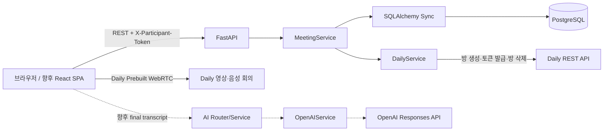
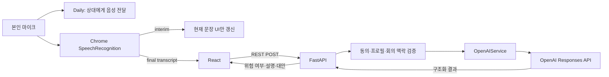

# 글로벌 회의 커뮤니케이션 코치 백엔드 인수인계서

> 작성 기준일: 2026-08-07
> 대상 저장소: `backend`
> 현재 완료 범위: 프로필 기반 URL 초대, Daily 화상회의, 한국어·영어 Web Speech 인수인계 경계
> 후속 범위: 발언 전 추천(F-02), 본인 발언 후 AI 피드백(F-03)
> 주의: 이 문서는 현재 코드, 제공된 API/DB 명세, 로컬 및 실제 Daily 검증 결과를 기준으로 작성되었다.

---

## 1. 문서 목적

이 문서는 다음 개발자가 현재 백엔드를 처음 받아도 아래 내용을 한 번에 파악하고 개발을 이어갈 수 있도록 작성되었다.

- 현재 구현된 기능과 의도적으로 구현하지 않은 기능
- FastAPI, PostgreSQL, Daily 사이의 책임 경계
- API 요청 흐름과 참가자 인증 방식
- 현재 DB 구조와 마이그레이션 상태
- 로컬 개발 환경 구성 및 실행 방법
- 테스트 방법과 확인된 결과
- 임시 화상회의 프론트의 목적과 제거 방법
- 향후 프로필 UI와 AI/STT 기능을 추가하는 정확한 순서
- 보안, 개인정보, 장애 격리 원칙
- Git에 올리기 전에 반드시 확인할 사항

이 저장소는 MVP 개발 속도와 후속 기능 추가 편의성을 함께 고려한 **모듈형 모놀리스**다. 현재 단계에서 마이크로서비스, Redis, Celery, 자체 WebSocket, 자체 WebRTC 서버는 사용하지 않는다.

---

## 2. 기준 문서와 우선순위

기능을 추가하거나 기존 동작을 변경할 때는 다음 순서로 기준을 확인한다.

1. 최신 합의된 요구사항
2. [API 명세 응답 형식.yaml](../../backend%20spec/API%20명세%20응답%20형식.yaml)
3. [api-db-spec.md](../../backend%20spec/api-db-spec.md)
4. [DB schema.sql](../../backend%20spec/DB%20schema.sql)
5. 현재 코드와 자동 테스트

문서와 코드가 다르면 임의로 한쪽을 따라가지 말고 다음을 먼저 확인한다.

- 오늘 구현 범위에서 의도적으로 제외된 것인지
- 명세가 변경됐지만 코드가 아직 반영되지 않은 것인지
- 코드가 명세보다 먼저 수정된 것인지

현재 차이점 중 가장 중요한 것은 다음과 같다.

- 전체 명세는 AI 기능까지 포함한 API 17개와 DB 테이블 4개를 정의한다.
- 현재 코드는 화상회의 범위 API 10개와 DB 테이블 2개만 구현한다.
- AI API가 아직 없는 것은 누락이 아니라 현재 스프린트 범위에 따른 의도적인 상태다.
- `tests/test_openapi_scope.py`도 현재 범위에 AI API가 노출되지 않는지 검증한다.

---

## 3. 현재 목표와 구현 범위

### 3.1 현재 완료된 사용자 흐름

1. 호스트가 회의 제목, 최대 인원, 프로필을 입력한다.
2. 백엔드가 Daily private room을 생성한다.
3. 백엔드가 회의와 호스트 참가자를 PostgreSQL에 저장한다.
4. 호스트가 참가자 토큰과 공유 링크를 받는다.
5. 초대받은 사용자가 공유 링크를 연다.
6. 공개 회의 정보를 확인하고 프로필을 입력한다.
7. 정원 및 중복 이름 검증 후 참가자 토큰을 받는다.
8. 인증된 참가자가 Daily 단기 meeting token을 발급받는다.
9. 브라우저가 Daily Prebuilt로 영상·음성 회의에 접속한다.
10. 참가자 목록과 프로필을 조회하거나 본인 프로필을 수정한다.
11. 일반 참가자는 나가고, 호스트는 전체 회의를 종료한다.
12. 회의 종료 시 참가자 개인정보를 삭제하고 회의 최소 메타데이터만 남긴다.

### 3.2 현재 구현된 기능

- 회원가입 없는 회의 생성
- UUID 기반 공유 URL 초대
- 호스트와 일반 참가자 역할 구분
- 입장 전 공개 회의 정보 조회
- 참가자 프로필 입력
- 2~4명 정원 제한
- 대소문자 무시 표시 이름 중복 방지
- 동시 입장 시 정원 초과 방지
- 회의 범위 임시 참가자 토큰
- Daily private room 생성
- 참가자별 Daily 단기 meeting token 발급
- 같은 회의 참가자 목록 조회
- 참가자 공개 프로필 상세 조회
- 본인 프로필 수정
- 일반 참가자 나가기
- 호스트 전체 회의 종료
- 종료 시 참가자 개인정보 삭제
- 공통 성공·실패 응답 형식
- 요청 ID 기반 오류 추적
- 실제 Daily 통합 확인용 임시 프론트
- `ko-KR`·`en-US` 선택형 Web Speech 음성→텍스트 컨트롤러
- interim/final transcript 분리 및 최근 final 3개 탭 메모리 표시
- AI 담당자가 연결할 `webspeech-final-transcript` 브라우저 이벤트
- F-02/F-03 AI 엔드포인트 (`POST /api/v1/ai/pre-speech`, `POST /api/v1/ai/speech-feedback`) — **단, 아래 3.3.1의 단순화된 형태**

### 3.3 아직 구현하지 않은 기능

- 회원가입, 로그인, JWT, refresh token
- 정식 React에서의 SpeechRecognition 연동
- Daily 마이크 mute 상태와 SpeechRecognition 자동 동기화
- final transcript의 FastAPI 전송 (프론트가 아직 AI 엔드포인트를 호출하지 않음)
- 참가자 토큰 인증이 걸린 회의 범위 AI 엔드포인트 (`/meetings/{meeting_id}/pre-speech` 등 6절 표의 12~17번 스펙 경로)
- AI 요청 rate limit 정책 (timeout은 구현됨, rate limit 대응은 없음 — 3.3.1 참고)
- `pre_speech_requests` 테이블, `speech_feedback` 테이블 (DB 저장 없음, 매 요청이 stateless)
- 30초 중복 경고 억제 (16.6절)
- 정식 React 프론트엔드
- WebSocket/SSE 기반 실시간 presence
- 원본 오디오 업로드 또는 녹음 저장
- 전체 회의 transcript 저장
- 다른 참가자 음성 분석

### 3.3.1 AI 엔드포인트의 현재 구현 범위 (2026-08-09 추가)

`fastapi-project`(프롬프트 프로토타입)의 F-02/F-03 시스템 프롬프트를 이 백엔드로 이식했다. 다만 17절이 정의한 정식 설계와 다음이 다르다.

- 엔드포인트가 `/api/v1/ai/pre-speech`, `/api/v1/ai/speech-feedback`로 독립적이다. `meeting_id`나 참가자 토큰과 연결되지 않는다.
- 요청 body에 상대방 프로필(`CounterpartProfile`)을 클라이언트가 직접 실어 보낸다. 회의·참가자 DB에서 프로필을 조회하지 않는다.
- 응답을 DB에 저장하지 않는다. `pre_speech_requests`, `speech_feedback` 테이블과 마이그레이션이 아직 없다.
- 동의(`voice_analysis_consent`), 회의 상태(ACTIVE/ENDED) 확인이 없다.
- 30초 중복 경고 억제 로직이 없다.
- OpenAI 호출은 Chat Completions API + `response_format=json_object`를 사용한다. Responses API가 아니다.
- 감지 기준선(F-03 flagged 판정 기준)은 프롬프트 안의 서술형 지침과 예시 3개뿐이며, 별도 golden set 파일이나 자동 회귀 테스트는 없다. 현재 방침은 "애매하면 flagged=False로 관대하게"다. `tests/manual_qa/consistency_check.py`(중급/균형적/Product Manager 프로필 고정, 문장당 10회 반복)로 확인한 4개 경계 문장은 모두 10/10 안정적이다 (2026-08-14 기준):
  - `"That schedule is impossible."` → flagged=true, type=직접적 거절
  - `"Let's table this for now."` → flagged=true, type=관용어/속어
  - `"Honestly, that idea doesn't make sense."` → flagged=true, type=직접적 거절
  - `"Could you share the file when you get a chance?"` → flagged=false
  이 4개 외의 문장(예: 정중한 요청·애매한 비판의 다른 변형)은 아직 확인하지 않았다.
- **알려진 이슈**: 결제 수단이 없는 OpenAI 계정은 `gpt-4o-mini` 요청이 하루 50건(RPD)으로 제한된다. 한도 초과 시 `AppError(502, AI_PRE_SPEECH_FAILED/AI_SPEECH_FEEDBACK_FAILED)`로 그대로 실패하며 재시도 로직이 없다. 실사용 전 결제 수단 등록이 필요하다.
- 수동 QA 스크립트가 `tests/manual_qa/`에 있다 (`profile_variation_check.py`: 프로필 조합별 출력 비교, `latency_check.py`: 응답 시간 측정). 둘 다 실제 OpenAI API를 호출하므로 자동 테스트/CI에는 포함하지 않는다.

즉 지금 구현은 "AI 두뇌(프롬프트 + OpenAI 호출 + 에러 처리)만 먼저 옮겨온 상태"이고, 17절의 회의 연동·DB 저장·동의 검증·중복 억제는 후속 작업으로 남아 있다.

---

## 4. 전체 시스템 구조



### 4.1 영상·음성 책임 경계

FastAPI는 영상과 음성 스트림을 중계하지 않는다.

```text
일반 데이터: 브라우저 → FastAPI → PostgreSQL
방 제어:     FastAPI → Daily REST API
영상·음성:   브라우저 ↔ Daily
```

이 경계를 유지해야 하는 이유는 다음과 같다.

- 자체 WebRTC 시그널링, TURN/STUN, 미디어 서버를 만들지 않는다.
- 백엔드 네트워크로 원본 오디오와 영상이 들어오지 않는다.
- 화상회의 장애와 AI 장애를 분리할 수 있다.
- 기능 추가 시 Daily 연동과 AI 연동을 각각 독립적으로 변경할 수 있다.

### 4.2 현재 아키텍처 성격

현재 구조는 과도한 Clean Architecture나 범용 Repository 패턴을 도입하지 않은 가벼운 계층 구조다.

```text
API Router
    ↓
Service
    ↓
SQLAlchemy Model / 외부 서비스 Client
```

새 기능을 추가할 때 기존 `MeetingService`에 모든 로직을 몰아넣지 않고 기능별 Router, Schema, Service, Model을 추가한다.

---

## 5. 디렉터리 구조와 책임

```text
backend/
├─ app/
│  ├─ api/
│  │  ├─ dependencies.py        # DB, Daily, 참가자 인증 의존성
│  │  └─ v1/
│  │     ├─ meetings.py         # 현재 회의·참가자 API 10개
│  │     └─ router.py           # v1 라우터 조립
│  ├─ core/
│  │  ├─ config.py              # 환경 변수
│  │  └─ errors.py              # 공통 오류와 request_id
│  ├─ db/
│  │  ├─ base.py                # SQLAlchemy DeclarativeBase
│  │  └─ session.py             # Engine, SessionLocal, get_db
│  ├─ models/
│  │  ├─ meeting.py             # meetings ORM
│  │  └─ participant.py         # participants ORM
│  ├─ schemas/
│  │  ├─ common.py              # 공통 응답 모델
│  │  └─ meeting.py             # 회의·프로필 요청/응답 DTO
│  ├─ security/
│  │  └─ participant_token.py   # opaque token 생성·SHA-256
│  ├─ services/
│  │  ├─ meeting_service.py     # 회의 비즈니스 규칙
│  │  └─ daily_service.py       # Daily REST 연동
│  └─ main.py                   # FastAPI 생성, CORS, middleware
├─ alembic/
│  └─ versions/
│     └─ 20260806_0001_meetings_and_participants.py
├─ tests/
│  ├─ conftest.py               # 테스트 DB와 FakeDailyService
│  ├─ test_meeting_api.py       # 회의 전체 생명주기
│  ├─ test_daily_service.py     # Daily 요청 계약
│  ├─ test_openapi_scope.py     # 현재 API 범위
│  └─ test_participant_token.py # 토큰 보안
├─ .local-video-check/          # 저장소에 포함된 로컬 검증 프론트
│  ├─ index.html                # 회의 생성·참가·회의 화면
│  ├─ styles.css                # 최소 확인용 UI
│  ├─ app.js                    # API·Daily iframe·Web Speech 연결
│  └─ serve.py                  # SPA fallback 로컬 서버
├─ docs/
│  ├─ examples/
│  │  ├─ web-speech-recognition.js      # 프론트 인수인계용 Web Speech 컨트롤러
│  │  └─ web-speech-recognition.test.js # 마이크 없는 재현 테스트
│  └─ BACKEND_HANDOFF.md        # 현재 문서
├─ .env.example
├─ .gitignore
├─ alembic.ini
├─ docker-compose.yml
├─ pyproject.toml
└─ README.md
```

---

## 6. 현재 API 목록

Base URL:

```text
http://localhost:8000/api/v1
```

| 번호 | Method | Path | 인증 | 상태 | 설명 |
|---:|---|---|---|---|---|
| 1 | POST | `/meetings` | 없음 | 구현 | Daily 방, 회의, HOST 생성 |
| 2 | GET | `/meetings/{meeting_id}/public` | 없음 | 구현 | 입장 화면용 공개 정보 |
| 3 | POST | `/meetings/{meeting_id}/participants` | 없음 | 구현 | 프로필 입력 후 일반 참가 |
| 4 | GET | `/meetings/{meeting_id}` | 참가자 토큰 | 구현 | 회의 화면 초기 컨텍스트 |
| 5 | POST | `/meetings/{meeting_id}/media-session` | 참가자 토큰 | 구현 | Daily URL·단기 token 발급 |
| 6 | GET | `/meetings/{meeting_id}/participants` | 참가자 토큰 | 구현 | 참가자 요약 목록 |
| 7 | GET | `/meetings/{meeting_id}/participants/{participant_id}` | 참가자 토큰 | 구현 | 참가자 전체 공개 프로필 |
| 8 | PATCH | `/meetings/{meeting_id}/participants/me/profile` | 참가자 토큰 | 구현 | 내 프로필 수정 |
| 9 | POST | `/meetings/{meeting_id}/leave` | 참가자 토큰 | 구현 | 현재 참가자 나가기 |
| 10 | POST | `/meetings/{meeting_id}/end` | HOST 토큰 | 구현 | 회의 종료·개인정보 삭제 |
| 11 | PATCH | `/meetings/{meeting_id}/participants/me/voice-analysis` | 참가자 토큰 | 후속 | F-03 ON/OFF |
| 12 | POST | `/meetings/{meeting_id}/pre-speech` | 참가자 토큰 | 후속 | F-02 추천 생성 |
| 13 | GET | `/meetings/{meeting_id}/pre-speech/{request_id}` | 참가자 토큰 | 후속 | 내 F-02 결과 조회 |
| 14 | POST | `/meetings/{meeting_id}/pre-speech/{request_id}/regenerate` | 참가자 토큰 | 후속 | F-02 재생성 |
| 15 | POST | `/meetings/{meeting_id}/speech-feedback/analyze` | 참가자 토큰 | 후속 | F-03 final transcript 분석 |
| 16 | GET | `/meetings/{meeting_id}/speech-feedback` | 참가자 토큰 | 후속 | 내 F-03 피드백 목록 |
| 17 | PATCH | `/meetings/{meeting_id}/speech-feedback/{feedback_id}` | 참가자 토큰 | 후속 | 내 피드백 닫기 |

12~17번은 위 스펙 경로 기준으로는 여전히 "후속"이다. 대신 아래 두 개가 3.3.1절에서 설명한 단순화된 형태로 이미 구현되어 있다.

| - | POST | `/ai/pre-speech` | 없음 | 구현(단순형) | F-02 추천 생성, 회의 비연동, DB 미저장 |
| - | POST | `/ai/speech-feedback` | 없음 | 구현(단순형) | F-03 위험 판정, 회의 비연동, DB 미저장 |

Swagger:

```text
http://localhost:8000/docs
```

---

## 7. API 응답 규약

### 7.1 단일 성공 응답

```json
{
  "data": {}
}
```

### 7.2 목록 성공 응답

```json
{
  "data": [],
  "meta": {
    "count": 0
  }
}
```

### 7.3 오류 응답

```json
{
  "error": {
    "code": "MEETING_NOT_FOUND",
    "message": "회의를 찾을 수 없습니다.",
    "field_errors": null
  },
  "request_id": "uuid"
}
```

### 7.4 body 없는 성공

`/leave`, `/end`는 성공 시 `204 No Content`다.

새 API도 이 응답 형식을 유지한다. 프론트가 API마다 다른 오류 파싱 코드를 만들지 않도록 공통 envelope를 변경하지 않는다.

---

## 8. 주요 처리 흐름

### 8.1 회의 생성

```text
POST /meetings
  → Pydantic 입력 검증
  → Daily private room 생성
  → meetings INSERT
  → HOST participants INSERT
  → 참가자 opaque token 원문 1회 발급
  → DB에는 token SHA-256만 저장
  → share_url 반환
```

Daily 방 생성 이후 DB 저장이 실패하면 생성한 Daily 방 삭제를 최선 노력으로 시도한다.

### 8.2 공유 URL 참가

```text
/join/{meeting_id}
  → GET /public
  → 제목·상태·정원 확인
  → 프로필과 동의 입력
  → POST /participants
  → meeting 행 FOR UPDATE
  → 종료·정원·중복 이름 검증
  → MEMBER 저장과 token 발급
```

`SELECT ... FOR UPDATE`를 사용하기 때문에 한 자리만 남은 회의에 두 사용자가 동시에 요청해도 정원을 초과하지 않는다.

### 8.3 참가자 인증

보호 API 요청 헤더:

```http
X-Participant-Token: <create-or-join response token>
```

서버 검증 순서:

1. 회의 존재 확인
2. 회의 종료 여부 확인
3. 토큰 존재 확인
4. 토큰 SHA-256 계산
5. 같은 회의의 참가자 토큰 해시와 비교
6. 참가자가 이미 LEFT인지 확인

토큰은 로그인 토큰이 아니라 현재 회의 세션에서 참가자를 식별하는 임시 bearer token이다.

### 8.4 Daily 입장

```text
POST /media-session
  → 참가자 토큰 검증
  → Daily POST /meeting-tokens
  → room_name, participant UUID, display name 포함
  → HOST만 is_owner=true
  → exp와 eject_at_token_exp 포함
  → room_url과 단기 token 반환
```

Daily API key는 백엔드 `.env`에만 존재한다. Daily meeting token은 DB에 저장하지 않는다.

### 8.5 참가자 나가기

일반 참가자의 `/leave`는 참가자 행을 바로 삭제하지 않고 다음과 같이 변경한다.

- `status=LEFT`
- `left_at` 기록
- `updated_at` 갱신

### 8.6 호스트 회의 종료

```text
POST /end
  → HOST 권한 확인
  → meeting.status=ENDED
  → ended_at 기록
  → 해당 meeting의 participants 삭제
  → DB commit
  → Daily 방 삭제 best effort
```

Daily 삭제가 실패해도 참가자 개인정보 삭제는 완료한다. 외부 서비스 장애가 개인정보 삭제를 막지 않아야 한다.

---

## 9. 프로필 표시와 확장

현재 임시 프론트는 참가자 목록에서 다음 요약만 보여 준다.

- 이름
- 역할
- 소속
- 직무

백엔드는 이미 전체 공개 프로필 조회를 지원한다.

```http
GET /meetings/{meeting_id}/participants/{participant_id}
```

전체 공개 프로필:

- `display_name`
- `country_code`
- `organization`
- `job_title`
- `languages`
- `english_proficiency`
- `communication_style`
- `timezone`
- `additional_considerations`

정식 프론트 구현 권장 흐름:

```text
참가자 요약 카드
  → 카드 클릭
  → 상세 API 호출
  → 전체 프로필 모달
```

공개 범위는 같은 `meeting_id`이면서 `JOINED`인 참가자다. 토큰 해시, 동의 시각 같은 내부 필드는 공개하지 않는다.

---

## 10. 데이터베이스 설계

### 10.1 현재 실제 생성되는 테이블

현재 Alembic revision `20260806_0001`은 다음 테이블을 생성한다.

#### `meetings`

- UUID PK
- 제목
- `ACTIVE`/`ENDED`
- 최대 인원 2~4명
- Daily room name과 URL
- 생성·종료 시각

종료 후에도 제목, 상태, 시각 등 최소 메타데이터는 남긴다. 종료 링크에 다시 접근했을 때 `MEETING_ENDED`를 안정적으로 반환하기 위해서다.

#### `participants`

- UUID PK
- meeting FK
- 참가자 토큰 SHA-256
- HOST/MEMBER
- JOINED/LEFT
- 공개 프로필
- 프로필 공개 동의
- 음성 분석 동의와 ON/OFF 상태
- 입장·퇴장·수정 시각

### 10.2 주요 DB 제약조건

- 회의 최대 인원은 2~4명
- 한 회의에 HOST 한 명
- 같은 회의의 JOINED 표시 이름은 대소문자 무시 중복 금지
- 토큰 해시는 64자리 소문자 hex
- 프로필 공유 동의는 `TRUE` 필수
- `voice_analysis_enabled=TRUE`면 음성 분석 동의 필수
- JOINED면 `left_at IS NULL`
- LEFT면 `left_at IS NOT NULL`
- ACTIVE면 `ended_at IS NULL`
- ENDED면 `ended_at IS NOT NULL`

### 10.3 후속 AI 테이블

전체 DB 명세에는 다음 두 테이블도 정의돼 있지만 아직 마이그레이션하지 않았다.

#### `pre_speech_requests`

- F-02 한국어 의도
- 선택 대상 참가자
- 회의 맥락
- 추천 영어 표현
- 추천 이유
- 재생성 parent request
- 생성 시각

#### `speech_feedback`

- 본인 final transcript 중 위험이 감지된 문장
- 정규화 텍스트 SHA-256
- STT confidence
- 위험 유형
- 한국어 설명
- 대안 영어 표현
- VISIBLE/DISMISSED
- 생성·닫기 시각

이미 공유된 `20260806_0001` 파일을 수정하지 말고 새 revision으로 추가한다.

권장 파일명:

```text
20260806_0002_add_ai_feedback_tables.py
```

---

## 11. 보안과 개인정보 원칙

### 11.1 반드시 유지할 규칙

- `.env`를 Git에 포함하지 않는다.
- Daily API key와 OpenAI API key를 프론트에 넣지 않는다.
- 참가자 원문 토큰을 DB에 저장하지 않는다.
- 참가자 원문 토큰을 로그에 남기지 않는다.
- Daily meeting token을 DB나 로그에 남기지 않는다.
- 전체 프로필과 transcript를 로그에 남기지 않는다.
- OpenAI 원문 request/response payload를 운영 로그에 남기지 않는다.
- 같은 회의 참가자만 서로의 공개 프로필을 조회한다.
- 일반 참가자가 회의를 종료하지 못하게 한다.
- 회의 종료 시 참가자 및 AI 데이터를 삭제한다.

### 11.2 현재 토큰 특성

- `secrets.token_urlsafe(32)`로 생성
- 브라우저 `sessionStorage` 보관
- DB에는 SHA-256 해시만 보관
- create/join 성공 응답에서 원문을 한 번만 전달
- 회의 간 재사용 차단

### 11.3 개인정보 보존

현재 정책:

- 회의 중: 프로필과 위험 감지 피드백만 세션 목적으로 사용
- 회의 종료: 참가자 프로필과 AI 데이터를 삭제
- 회의 행: 종료 여부 응답을 위한 최소 메타데이터만 보존
- 원본 음성: FastAPI와 PostgreSQL로 보내거나 저장하지 않음
- 전체 transcript: 저장하지 않음

---

## 12. 로컬 개발 환경 구성

### 12.1 요구 사항

- Windows 기준 Python 3.12+
- PostgreSQL 15+ 또는 Docker PostgreSQL
- Daily 계정, 팀 도메인, API key
- PowerShell

### 12.2 가상환경과 패키지

```powershell
cd D:\Code\VScode-code\likelion14-team5\backend
python -m venv .venv
.\.venv\Scripts\python.exe -m pip install -e ".[dev]"
```

### 12.3 PostgreSQL DB

로컬 PostgreSQL/pgAdmin에서 개발용과 테스트용 DB를 분리한다.

```text
meeting_mvp
meeting_mvp_test
```

각 개발자는 자신의 로컬 PostgreSQL 계정과 비밀번호를 사용한다. 팀원이 개인 DB 비밀번호를 공유할 필요는 없다.

### 12.4 환경 변수

```powershell
if (-not (Test-Path .env)) { Copy-Item .env.example .env }
```

이 복사는 `.env`가 아직 없을 때만 한다. 이미 팀원의 실제 로컬 설정이 들어 있는 `.env`를 `.env.example`로 덮어쓰면 안 된다. 런타임의 `Settings`는 실행 위치와 관계없이 절대 경로로 `backend/.env`를 읽으며 `.env.example`은 읽지 않는다.

`.env` 예시 형식:

```env
DATABASE_URL=postgresql+psycopg://postgres:<LOCAL_PASSWORD>@localhost:5432/meeting_mvp
FRONTEND_ORIGIN=http://localhost:5173
PUBLIC_APP_URL=http://localhost:5173
DAILY_API_KEY=<DAILY_API_KEY>
DAILY_API_BASE_URL=https://api.daily.co/v1
DAILY_DOMAIN=<TEAM_DOMAIN>.daily.co
DAILY_ROOM_TTL_MINUTES=180
DAILY_TOKEN_TTL_MINUTES=120
DAILY_REQUEST_TIMEOUT_SECONDS=5
SQL_ECHO=false
```

주의:

- 특수문자가 포함된 DB 비밀번호는 URL encoding이 필요할 수 있다.
- Alembic에서는 URL-encoded 비밀번호의 `%`가 ConfigParser interpolation으로 해석되지 않도록 이미 escape 처리했다.
- `.env.example`에는 실제 비밀번호와 API key를 넣지 않는다.

### 12.5 마이그레이션

```powershell
.\.venv\Scripts\python.exe -m alembic upgrade head
.\.venv\Scripts\python.exe -m alembic current
.\.venv\Scripts\python.exe -m alembic check
```

기대 revision:

```text
20260806_0001 (head)
```

### 12.6 백엔드 실행

PowerShell 터미널 1에서 다음 프로세스를 계속 실행해 둔다.

```powershell
.\.venv\Scripts\python.exe -m uvicorn app.main:app --reload
```

확인 URL:

```text
http://127.0.0.1:8000/docs
```

---

## 13. 테스트 환경과 명령어

### 13.1 테스트 DB 준비

테스트는 개발 DB와 분리된 PostgreSQL DB를 사용한다.

```powershell
$env:TEST_DATABASE_URL='postgresql+psycopg://postgres:<LOCAL_PASSWORD>@localhost:5432/meeting_mvp_test'
$env:DATABASE_URL=$env:TEST_DATABASE_URL
.\.venv\Scripts\python.exe -m alembic upgrade head
```

이후 같은 터미널에서:

```powershell
.\.venv\Scripts\python.exe -m pytest -q -p no:cacheprovider
.\.venv\Scripts\python.exe -m ruff check .
.\.venv\Scripts\python.exe -m alembic check
```

테스트 후 개발 서버를 실행할 때는 새 터미널을 열거나 `DATABASE_URL` 환경 변수를 개발 DB로 복구한다.

### 13.2 테스트 방식

- PostgreSQL은 실제 테스트 DB 사용
- Daily REST API는 `FakeDailyService`로 대체
- 테스트마다 `meetings`, `participants` TRUNCATE
- 실제 Daily room은 자동 테스트에서 생성하지 않음
- FastAPI dependency override로 DB와 Daily 주입

### 13.3 현재 검증된 결과

2026-08-07 기준:

```text
pytest: 15 passed
warning: Starlette TestClient/httpx deprecation 경고 1건
ruff: 통과
alembic current: 20260806_0001 (head)
alembic check: No new upgrade operations detected
Web Speech fake recognition test: PASS
Web Speech state: starting → listening → stopping → idle
ko-KR final payload·confidence·source contract: 확인
```

Starlette TestClient 경고는 현재 동작 실패가 아니며 관련 패키지 버전 업그레이드 시 다시 확인한다.

Web Speech 자동 검증은 실제 마이크를 사용하지 않는 가짜 `SpeechRecognition`으로 수행했다. 실제 Chrome의 마이크 권한, 한국어·영어 인식 품질, Daily와 동시 마이크 사용은 사용자가 수동 확인해야 한다.

다음 명령으로 동일한 컨트롤러 테스트를 다시 실행할 수 있다.

```powershell
node --test --test-isolation=none docs/examples/web-speech-recognition.test.js
```

### 13.4 실제 Daily 통합 검증 결과

실제 개발 DB와 Daily 계정으로 다음 흐름을 확인했다.

```text
회의 생성: 201
공개 회의 조회: 200
일반 참가자 입장: 201
호스트 media-session: 200
일반 참가자 media-session: 200
두 토큰의 Daily room 일치: 확인
두 참가자 Daily token 발급: 확인
참가자 목록: 2명
호스트 회의 종료: 204
종료 후 meeting.status: ENDED
종료 시각: 저장
종료 후 participants: 0명
```

실제 Daily 테스트는 외부 방을 생성하므로 테스트 후 반드시 `/end`로 정리한다.

---

## 14. 로컬 화상회의 테스트 프론트

위치:

```text
.local-video-check/
```

구성:

- `index.html`: 회의 생성·참가·회의 화면
- `styles.css`: 최소 확인용 UI
- `app.js`: API 호출, sessionStorage, Daily iframe, polling, Web Speech UI 연결
- `serve.py`: SPA fallback과 인수인계용 Web Speech 컨트롤러 제공
- `docs/examples/web-speech-recognition.js`: 프론트와 정식 React가 재사용할 Web Speech 컨트롤러

실행:

FastAPI가 실행 중인 터미널 1은 종료하지 않는다. 새 PowerShell 터미널 2를 열고 `backend`로 이동한 뒤 실행한다.

```powershell
.\.venv\Scripts\python.exe .local-video-check\serve.py
```

접속:

```text
http://localhost:5173
```

화면에 `백엔드에 연결할 수 없습니다`가 나오면 `5173` 프론트만 실행된 상태다. 터미널 1에서 FastAPI `8000` 프로세스를 실행하고 `http://127.0.0.1:8000/docs`가 열리는지 먼저 확인한다.

확인 순서:

1. 일반 브라우저에서 호스트 회의 생성
2. 입장 전에 음성 인식 처리 동의 체크
3. 카메라·마이크 권한 허용
4. `한국어` 또는 `English` 선택
5. `음성 인식 시작` 클릭 후 말하기
6. 말하는 중 interim과 최근 확정 문장 final 확인
7. 확정 문장 복사·지우기 확인
8. 음성 인식 중지
9. 초대 링크를 다른 브라우저에서 열어 Daily 연결 확인
10. 호스트가 회의 종료

이 프론트는 저장소에 포함된 로컬 QA 도구이며 정식 제품 프론트는 아니다.

- 빌드 도구 없이 연결 검증만 수행한다.
- `index.html`, `styles.css`, `app.js`, `serve.py`는 Git에 포함한다.
- 실행 중 생성되는 `*.log`, `__pycache__`, `*.pyc`는 Git에 포함하지 않는다.
- 정식 React 프론트가 같은 검증 범위를 대체한 뒤 삭제 여부를 결정한다.
- 재사용 Web Speech 코드는 `docs/examples/web-speech-recognition.js`에도 별도로 유지한다.

정식 React 전환 후 정리 후보:

```text
backend/.local-video-check
```

---

## 15. 정식 프론트엔드 인수인계

정식 프론트는 별도 저장소에서 개발한다.

권장 기술:

- React + TypeScript
- Vite
- React Router
- TanStack Query
- React Hook Form
- Zod
- `@daily-co/daily-js` + Daily Prebuilt
- Chrome SpeechRecognition
- CSS Modules

권장 구조:

```text
src/
├─ api/
│  └─ meetings.ts
├─ features/
│  ├─ meeting-create/
│  ├─ meeting-join/
│  ├─ meeting-room/
│  ├─ participant-profile/
│  ├─ pre-speech/
│  └─ speech-feedback/
├─ components/
├─ schemas/
│  └─ profile.ts
├─ storage/
│  └─ participant-session.ts
└─ types/
   └─ api.ts
```

라우트:

```text
/                       회의 생성
/join/:meetingId        프로필 입력 후 참가
/meetings/:meetingId    Daily + 프로필 + AI 사이드바
```

정식 Daily 연결은 `@daily-co/daily-js` 사용을 권장한다.

```javascript
const callFrame = Daily.createFrame(container);

await callFrame.join({
  url: roomUrl,
  token: meetingToken,
});
```

프론트는 Daily `left-meeting`, 마이크 상태 변경, 권한 오류 이벤트를 처리하고 백엔드 `/leave` 또는 `/end` 수명주기와 연결해야 한다.

Web Speech 시작점은 [web-speech-recognition.js](examples/web-speech-recognition.js)를 사용한다. 이 파일은 프레임워크에 의존하지 않으므로 정식 React에서는 hook 또는 service로 감싸서 사용한다.

---

## 16. 향후 AI/STT 전체 설계

### 16.1 중요한 의미 구분

현재 문서에서 “백엔드가 음성을 처리하지 않는다”는 말은 **원본 오디오를 받지 않는다**는 뜻이다.

향후 백엔드는 다음 텍스트 데이터를 처리한다.

- 브라우저가 본인 마이크에서 얻은 final transcript
- 요청자의 프로필
- 선택한 상대방의 공개 프로필
- 회의 제목과 사용자가 입력한 맥락
- 최근 본인 발화 최대 3개

### 16.2 현재 구현된 Web Speech 인수인계 경계

현재 구현 파일:

```text
docs/examples/web-speech-recognition.js
docs/examples/web-speech-recognition.test.js
```

지원하는 동작:

- `window.SpeechRecognition || window.webkitSpeechRecognition` 감지
- `ko-KR` 한국어와 `en-US` 영어 선택
- `continuous=true`
- `interimResults=true`
- 수동 시작·중지·abort·destroy
- 브라우저가 예기치 않게 인식을 종료하면 안전 조건에서 재시작
- 권한 거부, 마이크 없음, 네트워크, 미지원 언어 오류 처리
- interim transcript와 final transcript 분리
- confidence 미제공 시 `null`
- 원본 오디오·transcript 서버 미전송

final transcript가 확정될 때 임시 프론트는 다음 브라우저 이벤트를 발생시킨다.

```javascript
window.addEventListener("webspeech-final-transcript", (event) => {
  const payload = event.detail;
  // AI 담당자가 이 payload를 F-03 API 요청으로 연결한다.
});
```

이벤트 payload:

```json
{
  "transcript": "안녕하세요 또는 That schedule is impossible.",
  "stt_source": "WEB_SPEECH",
  "stt_confidence": 0.91,
  "language": "ko-KR 또는 en-US"
}
```

현재 F-03 API 명세에는 `language`가 없다. 따라서 정식 연동 시 다음 기준을 사용한다.

- `en-US`: F-03 영어 발화 위험 분석 요청으로 전송
- `ko-KR`: 음성→텍스트 확인 또는 F-02 한국어 의도 입력 보조로 사용
- 한국어 발화도 F-03에서 분석하려면 API 명세와 AI 판정 범위를 먼저 확장

임시 프론트는 최근 final transcript 최대 3개만 탭 메모리에 보관한다. `sessionStorage`, DB, 로그, 백엔드에는 저장하지 않는다.

현재 임시 프론트는 Daily를 직접 iframe으로 넣기 때문에 Daily의 실제 mute 이벤트를 읽지 못한다. 정식 React에서는 `@daily-co/daily-js`의 참가자/마이크 상태 이벤트와 컨트롤러 `start()`, `stop()`, `abort()`를 연결해야 한다.

### 16.3 권장 흐름



### 16.4 F-02 발언 전 추천

입력:

- `input_ko`
- `target_participant_id` 또는 `null`
- `meeting_context`

AI 컨텍스트:

- 요청자 프로필
- 선택 대상의 공개 프로필
- 회의 제목과 맥락
- 대상이 없으면 문화권을 임의로 가정하지 않는 중립 표현

출력:

- `recommended_expression_en`
- `recommendation_reason_ko`
- 요청 UUID와 생성 시각

규칙:

- 실무 회의에서 바로 사용할 문장 한 개
- 직역보다 의도 보존
- 상대 프로필의 소통 방식과 추가 고려사항 우선
- 국가 코드만으로 성격이나 예절을 단정하지 않음
- OpenAI 성공 결과만 DB 저장
- 재생성은 새 행을 만들고 `parent_request_id`로 연결

### 16.5 F-03 발언 후 경고

브라우저 설정:

```text
SpeechRecognition 또는 webkitSpeechRecognition
lang = en-US
interimResults = true
continuous = true
```

처리 규칙:

- interim은 화면에만 표시
- `isFinal=true`만 API 요청
- 다른 참가자 오디오는 분석하지 않음
- Daily 녹화·transcription을 사용하지 않음
- 최근 본인 final transcript 최대 3개는 탭 메모리에만 보관
- 새로고침·나가기 시 최근 문맥 제거

AI 판정 범위:

- 지나치게 직접적인 거절·비판
- 사람이나 아이디어에 대한 공격으로 오해될 표현
- 의도 또는 책임 주체가 모호한 표현
- 비원어민에게 어려운 속어·농담·관용어
- 사용자가 직접 입력한 추가 고려사항과 충돌하는 표현

문법 교정기나 발음 평가기로 범위를 확대하지 않는다.

위험 없음:

```json
{
  "risk_detected": false,
  "feedback": null,
  "suppressed_duplicate": false
}
```

위험 있음:

```json
{
  "risk_detected": true,
  "feedback": {
    "risk_type": "DIRECT_REJECTION",
    "explanation_ko": "상대의 계획을 단정적으로 거절하는 표현으로 들릴 수 있어요.",
    "alternative_expression_en": "Given our current constraints, could we discuss an alternative schedule?",
    "transcript_may_be_inaccurate": false,
    "display_state": "VISIBLE"
  },
  "suppressed_duplicate": false
}
```

위험이 없는 문장은 DB에 저장하지 않는다. 위험이 감지된 문장만 저장한다.

### 16.6 중복 경고 억제

권장 순서:

1. transcript 소문자화
2. 공백과 구두점 정리
3. SHA-256 계산
4. 같은 참가자의 최근 30초 피드백 조회
5. 같은 hash와 risk type이면 새 행 저장 안 함
6. `suppressed_duplicate=true` 반환

첫 MVP에서 임베딩이나 유사도 모델을 추가하지 않는다.

### 16.7 분석 실행 조건

프론트는 다음 조건을 모두 만족할 때만 SpeechRecognition을 실행한다.

```text
Daily 입장 완료
AND voice_analysis_consent=true
AND voice_analysis_enabled=true
AND Daily 마이크 ON
AND 회의 ACTIVE
```

다음 상황에서는 `stop()` 또는 `abort()`한다.

- 분석 OFF
- Daily 마이크 음소거
- 회의 나가기
- 회의 종료
- 권한 거부

### 16.8 경고 전달 방식

현재 명세는 문장 종료 후 REST 요청·응답으로 개인 경고를 전달한다.

```text
final transcript
  → POST /speech-feedback/analyze
  → 동기 OpenAI 분석
  → 응답으로 경고 카드 표시
```

따라서 자체 WebSocket이나 SSE가 필요하지 않다. 다만 아래 요구가 생기면 별도 설계가 필요하다.

- 단어 단위로 말하는 도중 개입
- 서버가 먼저 전체 참가자에게 알림 push
- 원본 음성 스트리밍 분석
- 다른 참가자 음성 동시 분석

현재 경고는 발화한 본인에게만 표시하는 개인 피드백이다. 호스트 또는 전체 참가자 공개로 바꾸려면 API와 개인정보 정책을 먼저 변경한다.

---

## 17. AI 백엔드 구현 권장 구조

```text
app/
├─ api/v1/
│  ├─ meetings.py
│  ├─ pre_speech.py
│  └─ speech_feedback.py
├─ schemas/
│  ├─ meeting.py
│  ├─ pre_speech.py
│  └─ speech_feedback.py
├─ models/
│  ├─ meeting.py
│  ├─ participant.py
│  ├─ pre_speech_request.py
│  └─ speech_feedback.py
├─ services/
│  ├─ meeting_service.py
│  ├─ daily_service.py
│  ├─ pre_speech_service.py
│  ├─ speech_feedback_service.py
│  └─ openai_service.py
```

### 17.1 OpenAI SDK 경계

OpenAI SDK를 직접 아는 파일은 `openai_service.py` 하나로 제한한다.

```python
class OpenAIService:
    def generate_pre_speech(...):
        ...

    def analyze_speech_feedback(...):
        ...
```

Router, DB Service는 OpenAI 원본 JSON을 파싱하지 않고 Pydantic 구조화 결과만 받는다.

환경 변수:

```env
OPENAI_API_KEY=<OPENAI_API_KEY>
OPENAI_MODEL=<MODEL_ID>
OPENAI_REQUEST_TIMEOUT_SECONDS=<SECONDS>
```

모델명을 코드에 고정하지 않는다. 구현 시점의 공식 OpenAI 문서와 비용·지연·정확도 평가 결과로 모델을 선택한다.

OpenAI 공식 참고:

- https://developers.openai.com/api/docs/models
- https://developers.openai.com/api/docs/guides/latest-model

### 17.2 F-03 Service 처리 순서

```text
1. 참가자 토큰 검증
2. voice_analysis_consent 확인
3. voice_analysis_enabled 확인
4. transcript 길이·stt_source 검증
5. transcript 정규화와 hash 생성
6. 최근 30초 중복 후보 조회
7. 요청자 프로필과 회의 맥락 조회
8. OpenAIService 호출
9. Structured Output 검증
10. risk=false면 저장하지 않고 응답
11. risk=true면 speech_feedback 저장 후 응답
```

### 17.3 장애 격리

- OpenAI 실패는 AI 패널에만 표시한다.
- Daily iframe과 참가자 프로필 UI는 유지한다.
- timeout은 `504`, 일반 외부 API 실패는 `502`로 변환한다.
- 실패한 F-02 결과를 저장하지 않는다.
- F-03 분석 실패 시 transcript를 DB에 남기지 않는다.
- 사용자가 해당 문장만 재시도할 수 있게 한다.

---

## 18. 후속 구현 단계

### 단계 A: 현재 영상회의 코드 정식 정리

- `.env.example` placeholder 정리
- 전체 파일 인코딩과 README 표시 확인
- 로컬 테스트 프론트와 정식 React의 검증 범위 대조
- Git 첫 commit 전 secret 검사
- 현재 15개 테스트 재실행

### 단계 B: AI DB migration

- `PreSpeechRequest`, `SpeechFeedback` ORM 추가
- `20260806_0002` migration 추가
- FK cascade와 인덱스 확인
- 개발/테스트 DB upgrade
- downgrade 및 재-upgrade 확인

### 단계 C: OpenAIService

- OpenAI SDK dependency 추가
- 환경 변수 추가
- Responses API 호출 두 함수
- Pydantic Structured Output
- timeout과 sanitized error
- FakeOpenAIService 테스트 대역

### 단계 D: F-02 API

- 생성
- 결과 조회
- 재생성
- 같은 회의 대상 검증
- 자기 자신 대상 제한
- rate limit
- 성공 결과만 저장

### 단계 E: F-03 API

- 분석 ON/OFF
- final transcript 분석
- 위험 문장만 저장
- 30초 중복 억제
- 내 피드백 목록
- 피드백 닫기

### 단계 F: 정식 React 프론트

- API client와 타입
- 회의 생성·참가 화면
- Daily Prebuilt
- 참가자 요약 카드와 상세 모달
- F-02 패널
- SpeechRecognition
- F-03 개인 경고 카드
- 오류 격리와 재시도

### 단계 G: 통합 검증

- 두 브라우저 Daily 연결
- 전체 프로필 조회
- F-02 대상 프로필 반영
- F-03 위험/비위험 문장
- 마이크 mute와 분석 ON/OFF
- OpenAI 장애 중 Daily 유지
- 회의 종료 후 참가자·AI 데이터 삭제

---

## 19. 후속 테스트 체크리스트

### 19.0 Web Speech 인수인계 경계

- [x] `SpeechRecognition`/`webkitSpeechRecognition` 감지 코드
- [x] 한국어 `ko-KR` payload 자동 테스트
- [x] 영어 `en-US` 선택 UI
- [x] interim/final 결과 분리
- [x] final payload의 transcript/source/confidence/language 계약
- [x] 최근 final transcript 최대 3개 메모리 제한
- [x] 시작·듣기·중지·대기 상태 전환 자동 테스트
- [ ] 실제 데스크톱 Chrome 한국어 마이크 테스트
- [ ] 실제 데스크톱 Chrome 영어 마이크 테스트
- [ ] Daily 회의와 SpeechRecognition 동시 마이크 테스트
- [ ] 정식 React에서 Daily mute와 SpeechRecognition stop 동기화

### 19.1 DB와 인증

- [ ] 다른 회의 토큰으로 접근 불가
- [ ] LEFT 참가자 AI 요청 불가
- [ ] ENDED 회의 AI 요청 불가
- [ ] 일반 참가자 `/end` 불가
- [ ] AI 데이터가 다른 참가자에게 노출되지 않음

### 19.2 F-02

- [ ] 대상 없음 중립 표현
- [ ] 같은 회의 대상 프로필 반영
- [ ] 다른 회의 target ID 차단
- [ ] 자기 자신 target 차단
- [ ] 재생성 parent 연결
- [ ] OpenAI 실패 행 미저장

### 19.3 F-03

- [ ] 동의 없음 분석 차단
- [ ] 분석 OFF 요청 차단
- [ ] 위험 없음 `feedback=null`
- [ ] 위험 있음 DB 저장
- [ ] 동일 문장 30초 중복 억제
- [ ] 본인 피드백만 조회
- [ ] 본인 피드백만 dismiss
- [ ] 낮은 confidence 표시

### 19.4 장애와 개인정보

- [ ] OpenAI timeout이 Daily를 중단하지 않음
- [ ] Daily 장애가 프로필 화면을 중단하지 않음
- [ ] API key, token, transcript가 로그에 없음
- [ ] 회의 종료 시 participants 삭제
- [ ] 회의 종료 시 pre_speech_requests 삭제
- [ ] 회의 종료 시 speech_feedback 삭제

---

## 20. 알려진 한계와 기술 부채

### 20.1 현재 한계

- 계정이 없어 토큰을 잃으면 권한을 복구할 수 없다.
- 참가자 목록은 DB의 JOINED 상태이며 정확한 Daily presence가 아니다.
- 브라우저 강제 종료 시 `/leave`가 호출되지 않을 수 있다.
- Daily 방 삭제는 best effort다.
- API rate limit이 아직 없다.
- 테스트는 실제 Daily를 기본 호출하지 않는다.
- 정식 React 프론트가 아직 없다.
- SpeechRecognition은 브라우저 지원 차이가 있다.
- Web Speech 자동 테스트는 통과했지만 실제 마이크 인식 품질은 수동 검증 전이다.
- 임시 iframe은 Daily mute 상태를 읽지 못해 SpeechRecognition과 자동 동기화되지 않는다.
- final transcript는 아직 FastAPI/OpenAI로 전송하지 않는다.

### 20.2 MVP에서 의도적으로 허용하는 이유

- 최대 2~4명 소규모 회의다.
- 사용자 계정과 장기 세션이 없다.
- 빠른 기능 검증이 우선이다.
- WebSocket, Redis, 작업 큐를 지금 추가하면 운영 복잡도가 더 커진다.

### 20.3 확장 검토 시점

다음 조건이 실제로 생길 때만 구조 확장을 검토한다.

- 여러 백엔드 인스턴스 운영
- 사용자 계정과 장기 기록
- 실시간 서버 push
- 장시간 AI 작업
- 원본 음성 기반 분석
- 정확한 Daily presence 동기화
- 높은 동시 요청과 rate limiting

---

## 21. 트러블슈팅

### PostgreSQL password authentication failed

원인:

- `.env`의 비밀번호와 로컬 PostgreSQL 계정 비밀번호 불일치
- shell `DATABASE_URL`이 `.env`를 덮어씀

확인:

```powershell
Get-ChildItem Env:DATABASE_URL
```

실제 값과 비밀번호를 터미널이나 이슈에 복사하지 않는다.

### Alembic URL의 `%` 오류

URL-encoded 비밀번호의 `%`는 `alembic/env.py`에서 `%%`로 escape하도록 처리돼 있다. 해당 코드를 제거하지 않는다.

### `502 DAILY_ROOM_CREATE_FAILED`

확인 항목:

- `DAILY_API_KEY`
- `DAILY_DOMAIN`
- 인터넷 연결
- Daily API 상태
- API key가 현재 팀 도메인과 맞는지

로그에는 key와 전체 payload를 출력하지 않는다.

### CORS 오류

프론트 접속 주소와 `.env`를 정확히 맞춘다.

```env
FRONTEND_ORIGIN=http://localhost:5173
PUBLIC_APP_URL=http://localhost:5173
```

임시 프론트도 `http://localhost:5173`으로 연다. `127.0.0.1:5173`은 다른 origin이다.

### 카메라·마이크가 안 보임

- 브라우저 권한 확인
- Daily iframe 권한 확인
- 다른 앱이 카메라를 점유하는지 확인
- 테스트 브라우저 한쪽 마이크를 mute하여 울림 방지

### 포트 충돌

```powershell
Get-NetTCPConnection -LocalPort 8000 -State Listen
Get-NetTCPConnection -LocalPort 5173 -State Listen
```

---

## 22. Git 및 배포 전 체크리스트

### 22.1 절대 포함하지 않을 것

- [ ] `.env`
- [ ] `.venv/`
- [ ] 실제 DB 비밀번호
- [ ] Daily API key
- [ ] OpenAI API key
- [ ] 참가자 원문 token
- [ ] Daily meeting token
- [ ] 테스트 로그의 민감정보
- [ ] `.local-video-check/*.log`
- [ ] `.local-video-check/__pycache__/`

### 22.2 첫 commit 전 확인

```powershell
git status --short --untracked-files=all
git diff -- .gitignore .env.example
```

확인 사항:

- `.env.example`의 DB 비밀번호가 placeholder인지
- `.env.example`의 API key가 placeholder인지
- `.local-video-check`의 소스 4개만 포함되고 로그·캐시는 제외되는지
- migration과 ORM 모델이 일치하는지
- 문서와 실제 API 범위가 일치하는지

### 22.3 품질 확인

```powershell
.\.venv\Scripts\python.exe -m pytest -q -p no:cacheprovider
.\.venv\Scripts\python.exe -m ruff check .
.\.venv\Scripts\python.exe -m alembic check
```

### 22.4 현재 Git 반영 정책

- 기능 코드는 개인 브랜치 `jongwon`에서 커밋한 뒤 개발 브랜치 `dev`에 병합한다.
- `main`에는 개발 기능을 바로 병합하지 않는다.
- 로컬 테스트 프론트의 소스 4개는 Git에 포함하고 로그·캐시는 제외한다.
- push 전 `.env`, 실제 API key, DB 비밀번호와 stage 범위를 확인한다.

---

## 23. 다음 개발자가 먼저 결정할 제품 질문

코드를 작성하기 전에 아래 사항을 PM/팀과 확정한다.

1. F-03 경고는 발화한 본인에게만 보이는가?
   - 현재 명세: 본인에게만 표시
2. 문장이 끝난 후 수 초 내 피드백이면 충분한가?
   - 현재 명세: 충분함, REST 사용
3. 원본 음성을 백엔드로 보낼 것인가?
   - 현재 명세: 보내지 않음
4. Chrome SpeechRecognition 미지원 브라우저는 어떻게 할 것인가?
   - 현재 명세: F-03만 비활성화하고 회의는 유지
5. 전체 transcript를 저장할 것인가?
   - 현재 명세: 저장하지 않음
6. 회의 종료 후 AI 결과를 보존할 것인가?
   - 현재 명세: 모두 삭제
7. AI 경고를 호스트나 전체 참가자에게 공개할 것인가?
   - 현재 명세: 공개하지 않음

1~7의 답을 바꾸면 API, DB, 동의 문구, 개인정보 정책을 함께 수정해야 한다.

---

## 24. 인수인계 요약문

다음 내용을 후속 개발자에게 그대로 전달할 수 있다.

> 현재 백엔드는 FastAPI, SQLAlchemy, PostgreSQL, Daily REST API로 구성된 모듈형 모놀리스다. 영상과 음성 전달은 Daily가 담당하며 FastAPI는 원본 미디어를 받지 않는다. FastAPI는 회의·프로필·참가자 토큰·Daily 입장 token·종료와 개인정보 삭제를 담당한다. 현재 화상회의 범위 API 10개와 meetings/participants 테이블이 구현됐고 PostgreSQL 자동 테스트 15개와 실제 Daily 호스트·멤버 연결까지 확인했다. 참가자 목록은 요약 프로필을 반환하지만 상세 프로필 API에서 전체 공개 프로필을 이미 제공한다. Web Speech 인수인계 컨트롤러는 `ko-KR`과 `en-US`를 지원하며 interim/final을 분리하고 최근 final 3개만 탭 메모리에 둔다. final 확정 시 `webspeech-final-transcript` 이벤트로 transcript, source, confidence, language를 전달한다. 이 경계까지 자동 테스트했으며 실제 Chrome 마이크와 Daily 동시 사용은 수동 확인이 남아 있다. 향후 AI 기능은 영어 final transcript만 FastAPI에 보내는 구조로 연결하고, 한국어 transcript는 F-02 의도 입력 보조로 사용할 수 있다. FastAPI는 참가자 동의와 프로필·회의 맥락을 검증한 뒤 OpenAIService를 호출한다. 위험이 없는 문장은 저장하지 않고 위험이 있을 때만 speech_feedback에 저장해 발화한 본인에게 한국어 설명과 영어 대안 표현을 반환한다. AI 실패는 Daily 화상회의와 분리하며 회의 종료 시 참가자와 모든 AI 데이터를 삭제한다. AI 구현 시 기존 migration을 수정하지 말고 0002 migration, 별도 Router/Schema/Service/Model, FakeOpenAIService 테스트를 추가한다.

---

## 25. 현재 완료 기준

현재 영상회의 단계는 다음 조건을 만족하므로 완료로 본다.

- [x] PostgreSQL schema 적용
- [x] 회의와 HOST 생성
- [x] 공유 URL 생성
- [x] 프로필 입력 후 MEMBER 참가
- [x] 2~4명 정원과 동시 입장 제한
- [x] 참가자 토큰 인증
- [x] Daily private room
- [x] 호스트/멤버 Daily token
- [x] 참가자 목록·상세 프로필·프로필 수정
- [x] 일반 참가자 나가기
- [x] 호스트 종료와 참가자 개인정보 삭제
- [x] 자동 테스트 15개 통과
- [x] 실제 Daily 연결 및 종료 확인
- [x] 로컬 임시 프론트 확인
- [x] 한국어·영어 Web Speech 컨트롤러와 final 이벤트 경계
- [x] 가짜 인식기를 사용한 Web Speech 자동 테스트
- [ ] 실제 Chrome 마이크와 Daily 동시 사용 수동 확인
- [ ] 정식 React 프론트
- [x] F-02 OpenAI 추천 (단순형 — `/ai/pre-speech`, 회의 비연동, 3.3.1 참고)
- [x] F-03 final transcript API·OpenAI 경고 (단순형 — `/ai/speech-feedback`, 회의 비연동, 3.3.1 참고)
- [ ] AI 요청 rate limit/재시도 정책
- [ ] `pre_speech_requests`/`speech_feedback` DB migration과 저장
- [ ] AI 엔드포인트 참가자 토큰 인증 및 회의 맥락 연동
- [ ] 30초 중복 경고 억제

다음 스프린트는 AI DB migration과 위 회의 연동 항목을 별도 기능 단위로 진행한다.
